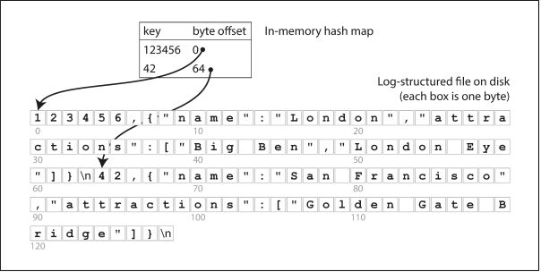
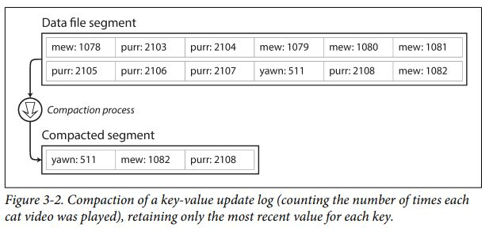
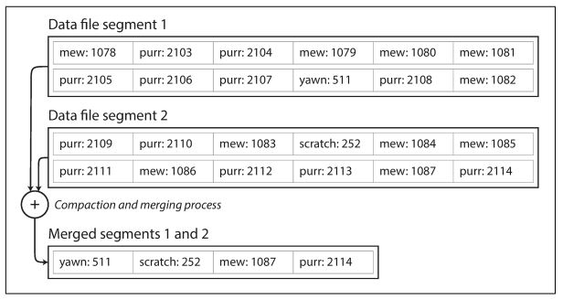

# Những điều mình hiểu về những DS đứng sau Database

### Một vài khái niệm
1. **Log** , log không phải công thức toán để tính toán độ phức tạp thuật toán với đầu vào size n. Log ám chỉ hành động ghi lại mọi thay đổi, nó là append only application. Rất nhiều database sử dụng log chạy ngầm, khi bạn update hoặc xóa một record, DB thực sự không xóa hay update, DB append record đó vào cuối file. 
2. **indexing** - tên 1 cấu trúc dữ liệu giúp tìm kiếm trở nên hiệu năng hơn, thông thường khi tìm kiếm 1 record trong DB, ngây ngô nhất là tìm kiếm từ đầu đến cuối hệ thống xem có tồn tại record đó không. Điều này tốn O(n), khi lượng record lớn dần lên, giả sử gấp đôi, thao tác tìm kiếm này đương nhiên mất gấp đôi thời gian. Để tìm kiếm hiệu quả hơn, ta sử dụng một cấu trúc dữ liệu mới có tên là **indexing**.     

 
Indexing giúp việc đọc dữ liệu trở lên hiệu quả, nhưng làm chậm việc ghi dữ liệu. Trong hầu hểt các trường hợp, việc ghi dữ liệu bằng cách append vào cuối file luôn có chi phí nhỏ nhất. 

### Hash Indexes

Giả sử data storage chỉ chứa append only file log. Chiến lược Indexing sẽ là: **Duy trì 1 hash map  hash(key) = byte offset in file**. Cứ khi nào thêm hoặc update cặp key mới vào DB, ta update hash(new key). Khi nào cần đọc, dùng hash để tìm offset trong memory, sau đó lấy value ra.      

Fact: Bitcask (default storage engine in Riak- no SQL) sử dụng Hash Indexes, việc đọc và ghi trở nên rất hiệu quả (O(1)), thậm chí trước khi đọc từ database, nếu data mình cần lấy đã có trong cache, chúng ta không cần phải đụng tới việc đóng mở file in disk.    
Bitcask rất lý tưởng cho việc khi mà value của key được update liên tục. Ví dụ, key ở đây có thể là link của 1 video, value sẽ là số lần video đó được mở từ phía người dùng. Lượt xem sẽ tăng dần dần, cần 1 lượt write lớn vào DB. Ta có 1 lượng rất nhiều write vào disk, còn trong memory ta duy trì lưu tất cả key.     
Nhắc lại, đây là log application, chúng ta chỉ được append vào file. Khi lượt xem video trở lên nhiều, file cứ append mãi vào thì cuối cùng sẽ dẫn đến việc running out of disk space. Có 1 cách giải quyết vấn đề này: Chia nhỏ log ra thành nhiều **segment log** với dung lượng cố định. Khi một file đạt tới dung lượng tới hạn, ta lưu vào file mới. Ta có thể sử dụng kỹ thuật **compaction** - chỉ lưu giữ key có giá trị mới nhất trong log. (như hình dưới)     
    

 
Quá trình segment và compaction diễn ra đồng thời. Khi segment file đạt tới giới hạn, sẽ tạo segment file mới. Đồng thời, merged segment sẽ lưu giá trị mới nhất của các key.   
       
