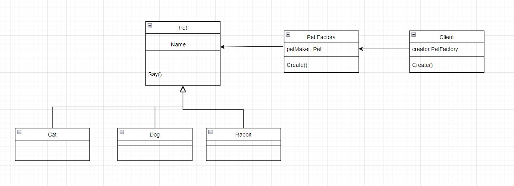

# Factory Method
### Identification:
- One of the creational patterns.
- Provides one of the best way to create an object
- Objects are created without exposing the logic to the client. The client just only pass string to it!      


```python
from abc import ABC,abstractmethod
class Pet(ABC):
    @abstractmethod
    def say():
        pass
class Cat(Pet):
    def say():
        print("Cat goes: meowwww")
class Dog(Pet):
    def say():
        print("Dog goes:Go go!")
class Rabbit(Pet):
    def say():
        print("Rabbit goes:chwit chwit")
class PetFactory:
    def __init__(self) -> None:
        self.petMaker = { "Cat":Cat,"Dog":Dog,"Rabbit":Rabbit}
    
    def create(self,type):
        return self.petMaker[type]

class Client:
    def __init__(self,name,creator) -> None:
        self.name = name
        self.creator = creator
    def create(self,petName):
        self.my_pet =  self.creator.create(petName)
        self.my_pet.say()
if __name__ == "__main__":
    client = Client("Harry",PetFactory())
    client.create("Dog")
    
```

Comments:      
- The client will not have access to the logic of code and the output represents the creation of html page.
- This method hepls our code more readable, easy to maintain and explore. ie:In Future, we have add on some kind of Pets like Fish, Chiken.... etc, we dont have to change code from the Client, we just defined new class and customize code in the Factory!