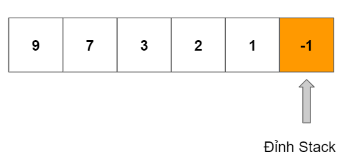

# Monotonic Stack/Deque - Ngăn xếp, hàng đợi 2 đầu đơn điệu.
- Stack hoặc deque này sẽ chứa danh sách các phần tử luôn tăng hoặc luôn giảm được gọi là stack/deque đơn điệu.     
Ví dụ cho 1 stack đơn điệu giảm 

```py
stack = [9,7,3,2,1,-1]
```
  　
<hr>
Trước khi thêm 1 phần tử element mới vào stack, ta sẽ phải check việc thêm element này có phá vỡ điều kiện stack đơn điệu hay không? Nếu có, pop phần tử cuối ra cho tới khi nào thỏa mãn. Cuối cùng, add phần tử này vào stack. 


```py
Giải thuật
def mono_stack(arr):
    stack = []
    for element in arr:
        # Duyệt từng phần tử trong mảng arr
        # Kiểm tra việc thêm phần tử stack có làm hỏng điều kiện stack đơn điệu giảm hay không
        # Nếu có pop
        while stack and stack[-1] <= element:
            stack.pop()
            # Chúng ta sẽ viết code logic ở chỗ này. 
        
        #Nhảy ra khỏi while, lúc này có thể thêm ele vào stack 
        stack.append(element)


        
dry run với arr = [3,1,6,2,5,4]
1.e = arr[0] = 3 -> stack =[3]
2.e = arr[1] = 1 -> 1 bé hơn phần tử ở đỉnh stack, add 1 vào đỉnh stack -> stack =[3,1]
3.e = arr[2] = 6 -> 
        6 lớn hơn phần tử ở đỉnh stack, pop 1 ra khỏi stack ([3,1] -> [3]),
        6 tiếp tục lớn hơn phần tử ở đỉnh stack, pop 3 ra khỏi stack. stack lúc này empty, ra khỏi while
        push 6 vào stack. stack = [6].
        Ố ồ: 6 chính là next larger của 3 và 1 theo chiều từ trái sang phải. 
4. e = arr[3] = 2 -> 2 < 6 - phẩn tử ở đỉnh stack . Nếu thêm 2 vào stack thì không vi phạm tính đơn điệu. Ta thêm 2 vào stack luôn stack = [6,2]
5. e = arr[4] = 5 -> 
        5  > 2, đẩy 2 ra khỏi đỉnh stack, 2 ghi nhận 5 là phần tử lớn hơn và gần nó nhất. Đỉnh stack lúc này là 6 (stack = [6])
        5 < 6, không vi phạm. thêm 5 vào stack. (stack =[6,5])
6. e = arr[5] = 4 -> 4 < 5, không vi phạm, ta thêm 4 vào stack. stack =[6,5,4]         
```
Kỹ thuật này giải được một lớp bài toán mà yêu cầu các phần tử thêm vào theo thứ tự. 
Easy:
496. Next Greater Element I
Medium:
739. Daily Temperatures
503. Next Greater Element II
