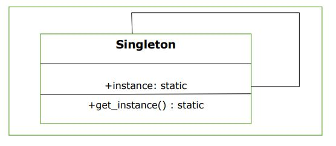

## Singleton
### Identification:
Singleton is a creational design pattern that lets you ensure that a class has only one instance, while providing a global access point to this instance.  
### Diagram   
      
Ensure that class has only one instance through the time
 
```python
class Singleton:

	__shared_instance = 'Singleton'
    
	@staticmethod
	def getInstance():
		"""Static Access Method"""
		if Singleton.__shared_instance == 'Singleton':
			Singleton()
		return Singleton.__shared_instance

	def __init__(self):
		"""virtual private constructor"""
		if Singleton.__shared_instance != 'Singleton':
			raise Exception("This class is a singleton class !")
		else:
			Singleton.__shared_instance = self
# main method
if __name__ == "__main__":

	# create object of Singleton Class
	obj = Singleton()
	print(obj)

	# pick the instance of the class
	obj = Singleton.getInstance()
	print(obj)

    #<__main__.Singleton object at 0x000001628B6EDF10>
    #<__main__.Singleton object at 0x000001628B6EDF10>
```
### When to use Singleton
- When logging needs to be implemented. 
- Configuration files is using because the cache of information needs to be maintained ans shared by all components in program.
- Managing a connection to database.