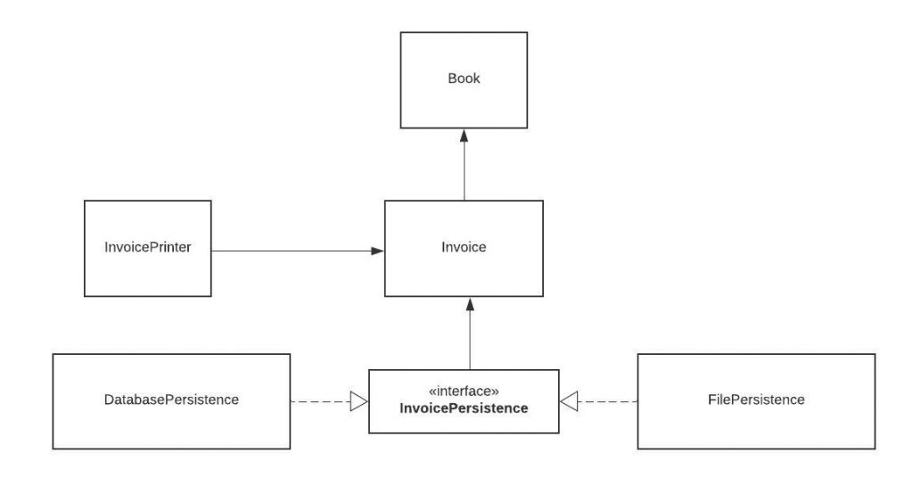

# Solid Principle

## Background

The Solid principle that all these concepts of clean coding, object-oriented architecture, and design patterns are some how connected and complementary to each other.

Following the SOLID acronym, they are:
- The Single Responsibility Principle
- The Open-Closed Principle
- The Liskov Substitution Principle
- The Interface Segregation Principle
- The Dependency Inversion Principle

### The Single Responsibility Principle

The Single Responsibility Principle states that a class should do one thing and therefore it should have only a single reason to change.

To state this principle more technically: Only one potential change (database logic, logging logic, etc.) in the software's specification should be able to affect the specification of the class.

This means that the entity of class should change only when we change the data model.

Following the Single Responsibility Principle is important.
- Because many different teams can work on the same project and edit the same class for different reasons, thi could lead to incompatible modules.
- It makes version control easier.
- Easier to resolve merge conflicts.

We create code for a simple bookstore invoice program as an example.

```
class Book {
private:
	string name;
	string authorName;
	int year;
	int price;
	string isbn;

public:
    Book (
        string name, 
        string authorName, 
        int year, 
        int price, 
        string isbn
    ) {
        name = name;
        authorName = authorName;
        year = year;
        price = price;
        isbn = isbn;
    }
}
```

This is a simple book class with some fields. Now create the invoice class which will contain the logic for creating the invoice and calculating the total price.

```
class Invoice {
private:
    Book book;
    int quantity;
    double discountRate;
    double taxRate;
    double total;

public:
    Invoice(
        Book book, 
        int quantity, 
        double discountRate, 
        double taxRate
    ) {
        book = book;
        quantity = quantity;
        discountRate = discountRate;
        taxRate = taxRate;
        total = calculateTotal();
    }

    double calculateTotal() {
        double price = ((book.price - book.price * discountRate) * this.quantity);

        double priceWithTaxes = price * (1 + taxRate);

        return priceWithTaxes;
    }

    void printInvoice() {
        cout << quantity << " x " << book.name << " " << book.price << "$" << endl;
        cout << "Discount Rate: " << discountRate << endl;
        cout << "Tax Rate: " << taxRate << endl;
        cout << "Total: " << total << endl;
    }
}
```

Here is our invoice class. It also contains some fields about invoicing and 2 methods:
- calculateTotal method, which calculates, the total price.
- printInvoice method, that should print the invoice to console

But we have some problem with this class, this class violates the Single Responsibility Principle in multiple ways.

The first violation is the printInvoice method, which contains printing logic. The SRP states that this class should only have a single reason to change, and that reason should be a change in the invoice calculation for this class.

But in this architecture, if we wanted to change the printing format, we would need to change the class. This is why we should not have printing logic mixed with business logic in the same class.

So how can we fix this print function?

We can create new classes for our printing and persistence logic so we will no longer need to modify the invoice class for those purposes.

Create class InvoicePrinter and move the method in to this class.

```
class InvoicePrinter {
private
    Invoice invoice;
   
public:
    InvoicePrinter(Invoice invoice) {
        invoice = invoice;
    }

    void printInvoice() {
        cout << quantity << " x " << book.name << " " << book.price << "$" << endl;
        cout << "Discount Rate: " << discountRate << endl;
        cout << "Tax Rate: " << taxRate << endl;
        cout << "Total: " << total << endl;
    }
}
```

Now our class structure obeys the Single Responsibility Principle and every class is responsible for one aspect of our application.

### Open-Closed Principle

The Open-Closed Principle requires that classes should be open for extension and closed to modification.

Modification means changing the code of an existing class, and extension means adding new functionality.

We should be able to add new functionality without touching the existing code for the class. This is cause whenever we modify the existing code, we are taking the risk of creating potential bugs. So we should avoid touching the tested and reliable (mostly) production code if possible.

It is usually done with the help of interfaces and abstract classes.

Now we create the database, connect to it, and we add a save method to new class call InvoicePersistence.

```
class InvoicePersistence {
private:
    Invoice invoice;

public:
    InvoicePersistence(Invoice invoice) {
        this.invoice = invoice;
    }

    void saveToFile(String filename) {
        // Creates a file with given name and writes the invoice
    }

    void saveToDatabase() {
        // Saves the invoice to database
    }
}
```

The problem here is we did not design the classes to be easily extendable in the future. So in order to add this feature, we have modified the InvoicePersistence class.

If our class design obeyed the Open-Closed principle we would not need to change this class. So we need to refactor the code to obey the principle

```
class InvoicePersistence {
public:
    InvoicePersistence() {}
    virtual ~InvoicePersistence(){}
    virtual void save(Invoice invoice) = 0;
}
```

We change the type of InvoicePersistence to Interface and add a save method. Each persistence class will implement this save method.

```
class databasePersistence : public InvoicePersistence {
public:

    void save(Invoice invoice) {
        //save to database;
    }
}
```

Now our class structure now looks like:



Now our persistence logic is easily extendable. If our boss asks us to add another database and have 2 different types of databases like MySQL and MongoDB, we can easily do that.

But let's say that we extend our app and have multiple persistence classes like InvoicePersistence, BookPersistence and we create a PersistenceManager class that manages all persistence classes:

```
class PersistenceManager {
    InvoicePersistence invoicePersistence;
    BookPersistence bookPersistence;
    
public:
    PersistenceManager(
        InvoicePersistence invoicePersistence,
        BookPersistence bookPersistence
    ) {
        invoicePersistence = invoicePersistence;
        bookPersistence = bookPersistence;
    }
}
```

We can now pass any class that implements the InvoicePersistence interface to this class with the help of polymorphism. This is the flexibility that interfaces provide

### Liskov Substitution Principle

The Liskov Substitution Principle states that subclasses should be substitutable for their base classes.

This means that, given that class B is a subclass of class A, we should be able to pass an object of class B to any method that expects an object of class A and the method should not give any weird output in that case.

This is the expected behavior, cause when we use inheritance we assume that the child class inherits everything that the superclass has. The child class extends the behavior but never narrows it down.

Therefore, when a class does not obey this principle, it leads to some nasty bugs that are hard to detect.

Liskov's principle is easy to understand but hard to detect in code. So let's look at an example.

```
class Rectangle {
private:
    int width, height;

public:
    Rectangle() {}

    Rectangle(int width, int height) {
        width = width;
        height = height;
    }
    
    int getWidth() {
        return width;
    }
    
    void setWidth(int width) {
        this.width = width;
    }
    
    int getHeight() {
        return height;
    }
    
    void setHeight(int height) {
        this.height = height;
    }
    
    int getArea() {
        return width * height;
    }
}
```

We have a simple Rectangle class, and a getArea function which returns the area of the rectangle.

Now we decide to create another class for Squares. As you might know, a square is just a special type of rectangle where the width is equal to the height.

```
class Square : public Rectangle {
public:
    Square() {}

    Square(int size) {
        width = height = size;
    }

    void setWidth(int width) {
        setWidth(width);
        setHeight(width);
    }

    void setHeight(int height) {
        setHeight(height);
        setWidth(height);
    }
}
```

Our Square class extends the Rectangle class. We set height and width to the same value in the constructor, but we do not want any client (someone who uses our class in their code) to change height or weight in a way that can violate the square property.

Therefore we override the setters to set both properties whenever one of them is changed. But by doing that we have just violated the Liskov substitution principle.

Let's create a main class to perform tests on the getArea function.

```
class Test {

   static void getAreaTest(Rectangle r) {
      int width = r.getWidth();
      r.setHeight(10);
      System.out.println("Expected area of " + (width * 10) + ", got " + r.getArea());
   }

   public static void main(vector<string> args) {
      Rectangle rc = new Rectangle(2, 3);
      getAreaTest(rc);

      Rectangle sq = new Square();
      sq.setWidth(5);
      getAreaTest(sq);
   }
}
```
Your team's tester just came up with the testing function getAreaTest and tells you that your getArea function fails to pass the test for square objects.

In the first test, we create a rectangle where the width is 2 and the height is 3 and call getAreaTest. The output is 20 as expected, but things go wrong when we pass in the square. This is because the call to setHeight function in the test is setting the width as well and results in an unexpected output.


### Interface Segregation Principle

Segregation means keeping things separated, and the Interface Segregation Principle is about separating the interfaces.

The principle states that many client-specific interfaces are better than one general-purpose interface. Clients should not be forced to implement a function they do no need.

This is a simple principle to understand and apply, so let's see an example.

```
class ParkingLot {
public:
	virtual void parkCar() = 0;	// Decrease empty spot count by 1
	virtual void unparkCar() = 0; // Increase empty spots by 1
	virtual void getCapacity() = 0;	// Returns car capacity
	virtual double calculateFee(Car car) = 0; // Returns the price based on number of hours
	virtual void doPayment(Car car) = 0;
}

class Car {

}
```

We modeled a very simplified parking lot. It is the type of parking lot where you pay an hourly fee. Now consider that we want to implement a parking lot that is free.

```
class FreeParking : public ParkingLot {
public:
	public void parkCar() {
		
	}

	public void unparkCar() {

	}

	public void getCapacity() {

	}

	public double calculateFee(Car car) {
		return 0;
	}

	public void doPayment(Car car) {
		throw new Exception("Parking lot is free");
	}
}
```

Our parking lot interface was composed of 2 things: Parking related logic (park car, unpark car, get capacity) and payment related logic.

But it is too specific. Because of that, our FreeParking class was forced to implement payment-related methods that are irrelevant. Let's separate or segregate the interfaces.


We've now separated the parking lot. With this new model, we can even go further and split the PaidParkingLot to support different types of payment.

Now our model is much more flexible, extendable, and the clients do not need to implement any irrelevant logic because we provide only parking-related functionality in the parking lot interface.

### Dependency Inversion Principle

The Dependency Inversion principle states that our classes should depend upon interfaces or abstract classes instead of concrete classes and functions.

These two principles are indeed related and we have applied this pattern before while we were discussing the Open-Closed Principle.

We want our classes to be open to extension, so we have reorganized our dependencies to depend on interfaces instead of concrete classes. Our PersistenceManager class depends on InvoicePersistence instead of the classes that implement that interface.

Reference source: [Solid Principle](https://www.freecodecamp.org/news/solid-principles-explained-in-plain-english/)