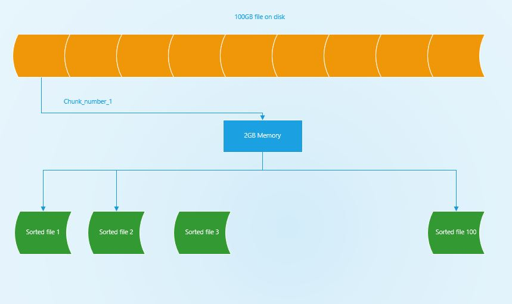

## Question: Imagine you have a 200 GB file on disk, with **one string per line**. Explain how you would sort the file with **only 2 GB** RAM machine.

### Some observations:
1. It is impossible to load the whole file on disk into RAM (200GB >> 2GB)
2. We must feed something into RAM that it's size less or equal than RAM size

### Algorithms:
1. Open the 200GB file
2. Read 2GB of the data in main memory and sorted it by QuickSort 
3. Write the sorted data in new file (to disk)
4. Repeat step 2 & 3 until read out of the resource file which is we have 200/2 = 100 sorted files in disk now
5. Create new file ,therefore we merge all sorted files into new file. Done!

### More specifix

