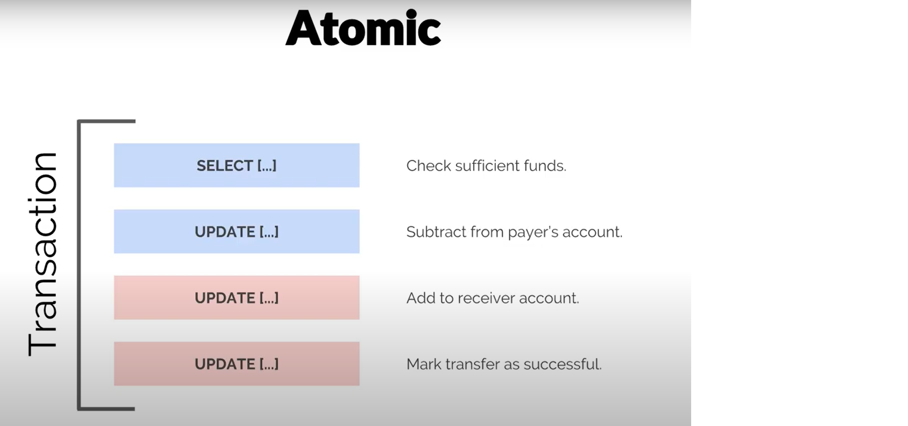

# ACID Transactions
  
## What is transaction?
Unit of work executed to retrieve,insert,remove, update data.  
Ex: Bank Transfer  
- Check sufficient funds (0)  
- Subtract from payer's account (1)  
- Add to receiver account (2)  
- Mark transfer as successful (3) 
In this example. Transaction is (0) + (1) + (2) + (3). This is up to the application programmer.  
```sql
SELECT [...] (0)  
UPDATE [...] (1)  
UPDATE [...] (2)  
UPDATE [...] (3)  
```
 
In a RDBMS, all transaction must be ... ACID  
Some DBMS transactions have BASE properties instead of ACID

## Atomic
### All or nothing
    
Atomic means that either all the queries and operations are run or none of them are. This is guarentees that if there is a failure at any point of during the transaction, then none of the statements are actually committed.
In the above example,if the first two queries **(0)**, **(1)** has run successfully and then money has been deducted from the payer's account, but however we failed to add the money to the receiver at two last queries **(2)**, **(3)**. **(1)** and **(2)** will be undo. And then the money would not be taken from payer's account.  
  
    

## Consistent
### After transaction is committed, data is still in a valid state.(ie. Constraints)
This means that integrity constraints must be maintained so that the database is consistent before and after the transaction. It refers to the correctness of a database. Referring to the example above,  
- Total amount of payer and receiver before and after transaction must be maintained
- After transaction, amount of payer never goes below zero
Therefore, the database is ***consistent***. Inconsistency occurs in case T1 completes but T2 fails. As a result, T is incomplete. 


## Isolated  
### The statements are executed in a seemingly sequential way.
Each transaction will run after previous tracsaction is complete!