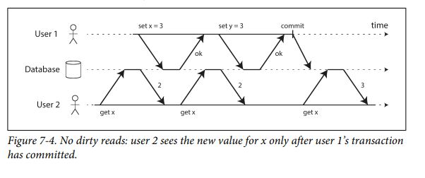
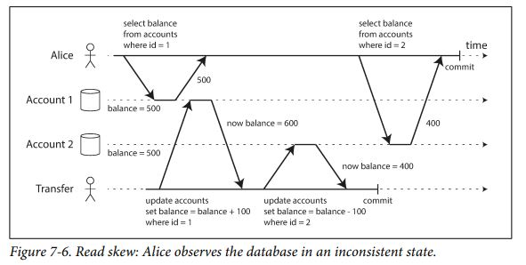

# ACID Transactions
  
## What is transaction?
Unit of work executed to retrieve,insert,remove, update data.  
Ex: Bank Transfer  
- Check sufficient funds (0)  
- Subtract from payer's account (1)  
- Add to receiver account (2)  
- Mark transfer as successful (3) 
In this example. Transaction is (0) + (1) + (2) + (3). This is up to the application programmer.  
```sql
SELECT [...] (0)  
UPDATE [...] (1)  
UPDATE [...] (2)  
UPDATE [...] (3)  
```
 
In a RDBMS, all transaction must be ... ACID  
Some DBMS transactions have BASE properties instead of ACID

## Atomic
### All or nothing
    
Atomic means that either all the queries and operations are run or none of them are. This is guarentees that if there is a failure at any point of during the transaction, then none of the statements are actually committed.
In the above example,if the first two queries **(0)**, **(1)** has run successfully and then money has been deducted from the payer's account, but however we failed to add the money to the receiver at two last queries **(2)**, **(3)**. **(1)** and **(2)** will be undo. And then the money would not be taken from payer's account.  
  
    

## Consistent
### After transaction is committed, data is still in a valid state.(ie. Constraints)
This means that integrity constraints must be maintained so that the database is consistent before and after the transaction. It refers to the correctness of a database. Referring to the example above,  
- Total amount of payer and receiver before and after transaction must be maintained
- After transaction, amount of payer never goes below zero  
Therefore, the database is ***consistent***.   


## Isolation  
### The statements are executed in a seemingly sequential way.
Each transaction will run after previous tracsaction is complete!
Isolation in the sense of ACID means that concurrently executing transactions are isolated from each other: **they cannot step on each other's toe**
If they do, it may cause the [Concurrency problems (Race Conditions)](https://cs50.harvard.edu/x/2022/notes/7/#problems)
### Weak Isolation Levels
#### 1. Read Committed
It makes two guarantees:  
1. **no dirty reads**:You will only see data that has been committed  
Imagine a transaction has written some data to the database, but the transaction has not yet committed or aborted. If another transaction see that uncommitted data, that is called a **dirty read**
  
  
  
2. **no dirty writes**:You can only overwrite data that has been committed
Imagine two transactions concurrently try to udpate the same object in a database. The first transaction has updated a record but has not yet commited, then the second transaction also overwrites that uncommitted value. That is **dirty write**  
##### Implementing read committed  
> It is default setting in many databases such as Oracle11g, PostgreSQL, SQL Sever 2012...  
>
> Prevent dirty write by using row-level locks: (1) lock that record, (2) hold that lock until the transaction is committed or aborted. If another tracsanction wants to write the same record, it must __wait__ until the previous transaction is committed or aborted.  
>
> Prevent dirty reads: One option would be to use same strategy like prevent dirty write. But this will make the application slow because one long-running write transaction can force many read-only transactions to
wait until the long-running transaction has completed. This harms the response time of read-only transactions. For that reason, most databases prevent dirty reads using: rememeber both the old commmitted value and new value set by the transaction currently holds the write lock. While the transaction in ongoing, any other transactions that read the record are simply given the old value! Only when the new value is committed do transactions switch over to reading the new value.  


#### 2. Snapshot Isolation and Repeatable Read   
Let's start with an example below:    

    
Alice has $1000 of saving at a bank, split across two account with $500 each. Now a transaction transfers $100 from one fo her accounts to the other. If she is unlucky enough to look at her list of account balances in the same moment as that transaction is being processed, se may see one account balance at a time before the incoming payment has arrived ($500), and the other account after outgoing transfer has been made ($400). To Alice now appears as though she only has total of $900 in her accounts - it seems that $100 has vanished into thin air. This is called **nonrepeatable read** for **read skew**. If Alice were to read the balance one again after then transaction transfer has been committed, she would see the incomming account with $600 and the other with $400. So, no need to worry if she reloads the online banking website few seconds later but.....   

> Taking a backup requires making a copy of the entire database, which may take hours on a large database
> 
> Sometimes, you may want to run a query that scans over large parts of the database   


#### Tobe continue.....

## Durability
Durability is the promise that once a transaction has committed successfully, any data it has written will not be forgotten, even if there is a hardware fault or the database crashes.  